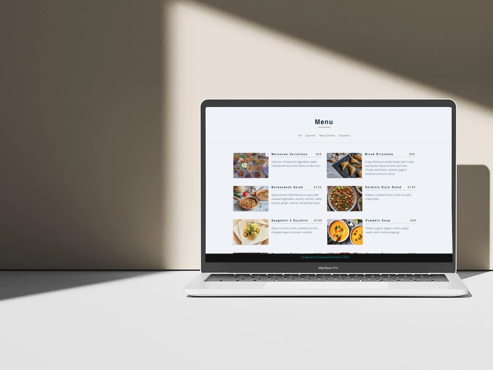

# Moroccan Restaurant Menu

This is a React web application that displays a menu for a Moroccan restaurant. Users can filter menu items by categories such as starters, main dishes, and desserts.

## Demo


## Table of Contents

- [Features](#features)
- [Installation](#installation)
- [Usage](#usage)
- [Contributing](#contributing)
- [License](#license)
- [Author](#author)

## Features

- Display menu items categorized as starters, main dishes, and desserts.
- Filter menu items by category.
- Show all menu items at once.

## Installation

1. Clone the repository:

   ```bash
   git clone https://github.com/hechadielhassania/moroccan_restaurant_react

2. Navigate to the project directory:

    ```bash
    cd moroccan-restaurant-menu

3. Install dependencies:

    ```bash
    npm install


## Usage

1. Start the development server:

    ```bash
    npm start

2. Open your browser and go to view the application.

    ```bash
    http://localhost:3000 


## Contributing

If you'd like to contribute to this project, you can follow these steps:

1. Fork the project.

2. Create your feature branch

    ```bash
    git checkout -b feature/AmazingFeature

3. Commit your changes

    ```bash
    git commit -m 'Add some AmazingFeature'

4. Push to the branch

    ```bash
    git push origin feature/AmazingFeature

5. Open a pull request.


## License

This project is licensed under the MIT License.

## Author

Designed by El Hassania Hechadi.


